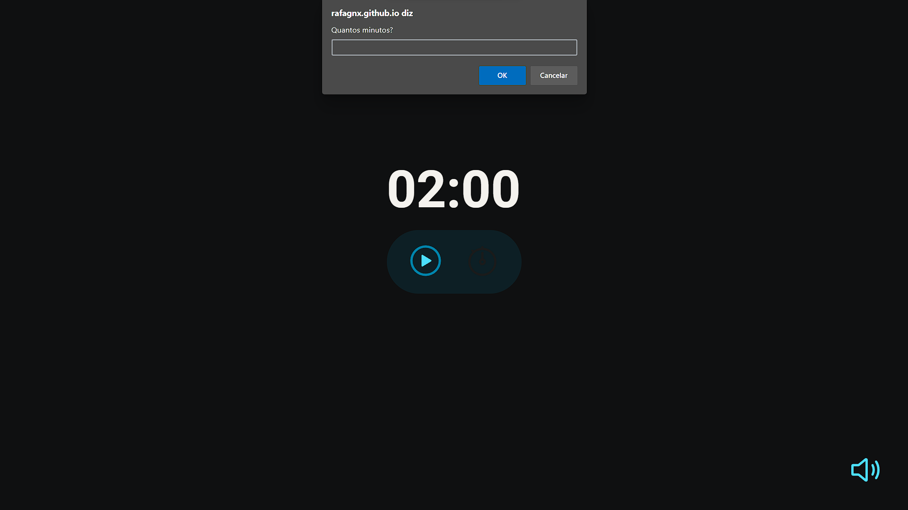

# FocusTimer

## 📖 Sobre

esse projeto foi criado no curso explorer da Rocketseat, Desafio "FocusTimer"cujo objetivo foi a criação de um temporizador estilo Pomodoro.

nesse projeto foi utilizado várias funçoes, Object literals, eventos como onsubmit, onclick, oninput, onKeyDown.

### Deploy

acesse [aqui](hhttps://rafagnx.github.io/TEMPORIZADOR/)

## Tecnologias
- HTML
- CSS
- Javascript 
  - Es6 Modules
  - functions
  - events
     - onclick
     - onsubmit
     - oninput
  - DOM
     - classlist
     - addclass
     - removeclass
     - innertext
     
### Preview

